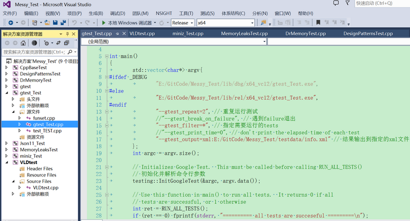

# Messy_Test
**The main role of the project:**
- C++/C++11/C++14/C++17/C++20's usage
- Design Pattern's usage
- Dr. Memory's usage [DynamoRIO/drmemory](https://github.com/DynamoRIO/drmemory)
- Json11's usage [dropbox/json11](https://github.com/dropbox/json11)
- VLD's usage [Visual Leak Detector](http://vld.codeplex.com/releases)
- miniz's usage [richgel999/miniz](https://github.com/richgel999/miniz)
- tar package' parse
- regular expression's usage
- multi thread's usage
- Google Test(gtest)'s usage [google/googletest](https://github.com/google/googletest)
- spdlog's usage [gabime/spdlog](https://github.com/gabime/spdlog)
- cJSON's usage [DaveGamble/cJSON](https://github.com/DaveGamble/cJSON)
- yaml-cpp's usage [jbeder/yaml-cpp](https://github.com/jbeder/yaml-cpp)
- RapidJSON's usage [Tencent/rapidjson](https://github.com/Tencent/rapidjson/)
- libuuid's usage [sourceforge](https://sourceforge.net/projects/libuuid/)
- TinyXML2's usage [leethomason/tinyxml2](https://github.com/leethomason/tinyxml2)
- C++ plugin's usage
- jemalloc's usage [jemalloc/jemalloc](https://github.com/jemalloc/jemalloc)
- ThreadPool's usage [EterfreeA/ThreadPool](https://github.com/EterfreeA/ThreadPool)
- test code in the technical book
	- "Efficient C++ Performance Programming Techniques"
	- "Effective C++ (third edition)"
	- "More Effective C++"
	- "Effective STL"
	- "Effective Modern C++"
	- "C++ API Design"
	- "Secure Coding in C and C++(Second Edition)"
- database's usage
	- SQL Server on windows
	- PostgreSQL(libpqxx) on windows
	- SQLite on windows

**The version of each open source library see:** [version.txt](src/version.txt)

**The project support platform:**
- Windows 10 64-bit: It can be directly build with VS2022 in windows 10 64-bit.
- Linux(ubuntu 22.04, g++ 13.1.0):
	- CppBaseTest supports cmake build(file position: prj/linux_cmake_CppBaseTest/)
	- DesignPatternsTest supports cmake build(file position: prj/linux_cmake_DesignPatternsTest/)
	- gtest_Test support cmake build(file position: prj/linux_cmake_gtest_Test/)
	- Json11_Test support cmake build(file position: prj/linux_cmake_Json11_Test/)
	- miniz_Test support cmake build(file position: prj/linux_cmake_miniz_Test/)
	- spdlog_Test support cmake build(file position: prj/linux_cmake_spdlog_Test/)
	- cJSON_Test support cmake build(file position: prj/linux_cmake_cJSON_Test/)
	- Messy_Test support cmake build(test code include: yaml-cpp, RapidJSON, libuuid, TinyXML2, jemalloc, ThreadPool; file position: prj/linux_cmake_Messy_Test/)
	- Plugin_Test support cmake build(file position: prj/cmake_Plugin_Test, it supports both windows and linux)

**Windows VS Screenshot:**  

**Blog:** [fengbingchun](http://blog.csdn.net/fengbingchun/article/category/725584)
